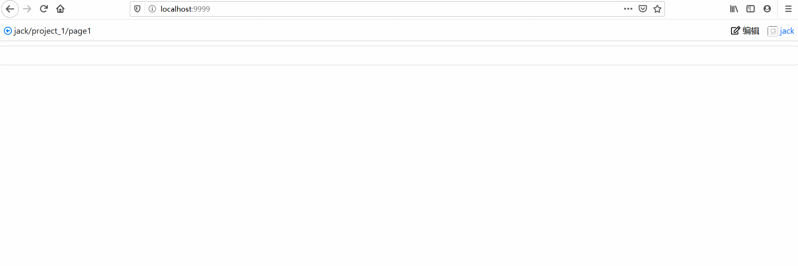

# Page Designer

[](https://badge.fury.io/js/page-designer)
[](https://travis-ci.org/blocklang/page-designer)
[](https://codecov.io/gh/blocklang/page-designer)

Page Designer 是一款可视化的 web 页面设计器。

一个 web 页面包含三部分内容：

* 用户界面 - 由一组嵌套的 Widget (UI 部件)组成，支持响应式设计；
* 页面数据 - 描述页面中的状态数据和业务数据；
* 页面事件 - 绑定在 Widget 上，用于调整页面数据。

Page Designer 相应包含三块区域：UI 设计区、数据编辑区和事件定义区。

## 演示图



## 如何使用

使用以下命令安装：

```shell
npm install designer-core
npm install page-designer
```

在页面中添加 `PageDesigner` 部件：

```tsx
import PageDesigner from "page-designer";
import { User, Permission, Page, Path, RequestUrl, RouteName } from "page-designer/interfaces";
import { Project } from "@blocklang/designer-core/interfaces";

// 登录用户的基本信息
const user: User = { name: "jack", avatar: "url" };
// 项目基本信息
const project: Project = {id: 1, name: "project_1", createUserName: "jack"};
// 登录用户对项目的操作权限
const permission: Permission = { canRead: true, canWrite: true };
// 当前编辑的页面信息
const page: Page = { id: 1, key: "page1", name: "页面1", appType: "01"/*web*/ };
// 当前编辑页面相对项目根目录的路径信息
const pathes: Path[] = [{ name: "page1", path: "page1" }];
// 与服务器端交互的 url
const urls: RequestUrl = {
    // 获取项目依赖的部件列表，按仓库分组
    fetchApiRepoWidgets: `http://localhost:3000/designer/projects/${project.id}/dependences/widgets`,
    // 获取项目依赖的 RESTful API 列表，按仓库分组
    fetchApiRepoServices: `http://localhost:3000/designer/projects/${project.id}/dependences/services`,
    // 获取项目依赖的 JavaScript 对象列表，按仓库分组
    fetchApiRepoFunctions: `http://localhost:3000/designer/projects/${project.id}/dependences/functions`,
    // 获取项目依赖的 ide 版 UI 库、API 库，以及 api 版 service 仓库的基本信息
    fetchIdeDependenceInfos: `http://localhost:3000/designer/projects/${project.id}/dependences?category=dev`,
    // 获取页面模型
    fetchPageModel: `http://localhost:3000/designer/pages/${page.id}/model`,
    // 更新页面模型
    savePageModel: `http://localhost:3000/designer/pages/${page.id}/model`,
    // 托管第三方组件库资源文件的 host 信息
    externalScriptAndCssWebsite: "http://localhost:3001"
};
// 设计器工具栏中的路由信息，分别设置跳转到登录用户的 profile 页面和返回到父目录的路由
const routes: RouteName = { profile: "", parentGroup: "" };

<PageDesigner 
    user={user}
    project={project}
    permission={permission}
    page={page}
    pathes={pathes}
    urls={urls}
    routes={routes}
/>
```

## 开发

本设计器基于 [Dojo](https://dojo.io) 开发。

在项目根目录下，打开三个命令行界面，分别运行以下三个命令。

### 启动 [Json Server](./docs/json-server.md)

[Json Server](./docs/json-server.md) 用于 mock 本项目使用的 RESTful API。运行以下命令启动：

```shell
npm run json-server
```

### 启动 [Serve](./docs/serve.md)

[Serve](./docs/serve.md) 用于托管第三方组件库。

从 git 仓库下载完源码后，项目根目录下的 `serve` 文件夹中没有 ide 版的部件，需在 `serve` 文件夹下安装第三方的 ide 版组件库。

安装 Widget 组件库 [ide-widgets-bootstrap](https://github.com/blocklang/ide-widgets-bootstrap)：

1. 从 github 下载 [ide-widgets-bootstrap](https://github.com/blocklang/ide-widgets-bootstrap) 源码；
2. 进入 ide-widgets-bootstrap 根目录后执行 `npm run build` 命令构建项目；
3. 构建后的代码存放在 ide-widgets-bootstrap 项目的 `output/dist/` 文件夹中；
4. 复制 ide-widgets-bootstrap 项目 `output/dist/` 文件夹中的所有文件，粘贴到本项目的 `serve/designer/assets/github.com/blocklang/ide-widgets-bootstrap/0.1.0/` 文件夹中。

安装 Web API 组件库 [ide-web-api](https://github.com/blocklang/ide-web-api)：

1. 从 github 下载 [ide-web-api](https://github.com/blocklang/ide-web-api) 源码；
2. 进入 ide-web-api 根目录后执行 `npm run build` 命令构建项目；
3. 构建后的代码存放在 ide-web-api 项目的 `output/dist/` 文件夹中；
4. 复制 ide-web-api 项目 `output/dist/` 文件夹中的所有文件，粘贴到本项目的 `serve/designer/assets/github.com/blocklang/ide-web-api/0.1.0/` 文件夹中。

然后运行以下命令启动 serve：

```shell
npm run serve
```

### 启动 Page Designer

运行以下命令启动 Page Designer:

```shell
npm run dev
```

启动成功后，在浏览器中访问 `http://localhost:9999` 即可。
